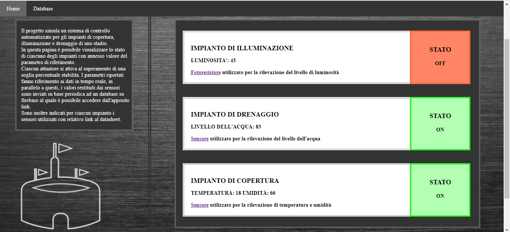

# Alarm system using ESP32, Arduino and Firebase

## Brief description
This project was developed during the third year of the bachelor degree in Electronics and Telecommunication Engineering together with Leonardo Di Iorio.

The aim of the project was to simulate an alarm system capable of detecting situations of flooding, bad weather and obscurity.

We developed an arduino sketch that runs on an ESP32 board. In detail the sketch **main.ino**:

* controls some sensors and actuators.
* creates and updates an html page hosted on a web server.
* sends the data to a real time database hosted on Firebase.
* makes these operations non blocking exploiting the *millis()* function.

The html code is visible in the file **homepage.h** while the file **secrets.h** contains sensible data  used for connection to the local Wi-Fi and Firebase. The file **firebase.json** contains the data received by Firebase.

Sensors and actuators used are:

* water level sensor with relative buzzer.
* DHT11 sensor (for temperature and humidity) with relative blinking led.
* photoresitor with relative led.

## HTML page
Here you can see the html page reporting the measures of the sensors and the state of the actuators

